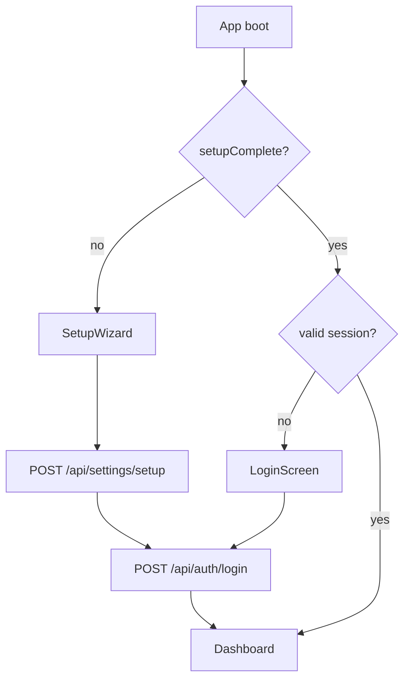

# Feature: Setup, Auth, and User Access

## Status

**Partial** — single-user Plex token setup and session auth are shipped; Plex OAuth, admin users, and session refresh are planned.

## Implementation Snapshot

### Shipped

| Capability | UI | API |
|------------|-----|-----|
| First-run setup wizard | `SetupWizard.tsx` | `POST /api/settings/setup`, `GET /api/settings/status` |
| Plex/TMDb validation during setup | `SetupWizard.tsx` | `POST /api/settings/test-plex`, `POST /api/settings/test-tmdb` |
| Returning-user login | `LoginScreen.tsx` | `POST /api/auth/login` |
| Session cookie auth | `AuthContext.tsx` | `GET /api/auth/me`, `DELETE /api/auth/logout` |
| App boot routing | `src/app/page.tsx` | `GET /api/settings/status` |
| Reconfigure expired token | `LoginScreen.tsx`, `page.tsx` | `POST /api/settings/setup` |

**Auth model:** Singleton `Settings` document stores encrypted Plex token, server URL, username, JWT secret, and encryption key. `requireAuth()` validates `decidarr_session` JWT and returns decrypted Plex credentials from settings.

**Session flow:**

### Planned (not on disk)

| Capability | Expected API | Notes |
|------------|--------------|-------|
| Plex PIN/OAuth | `POST /api/auth/plex/start`, `POST /api/auth/plex/poll` | `User` model exists; no routes or UI |
| Session refresh | `POST /api/auth/refresh` | No route file |
| Admin user list/update | `GET/PATCH /api/admin/users`, `PATCH /api/admin/users/[plexUserId]` | No route files |
| Multi-user data scoping | — | Library/watched/selection routes use `SINGLE_USER_ID` |

### Known gaps

- `LoginScreen` does not expose OAuth; copy says "Self-hosted · Single user."
- `AuthContext` has no `refresh` method; session expires without silent renewal.
- `GET /api/auth/me` returns `settings.uiPreferences`, not per-user `User.preferences`.

## 1. Data Model Changes

### Current

- **`Settings`** (`src/lib/models/Settings.ts`): singleton `_id: app-settings`; encrypted Plex token, TMDb key, Tautulli key, JWT secret, encryption key; Plex server URL, username, machine ID; `setupComplete`; `uiPreferences`; `spinHistoryPreferences`.
- **`User`** (`src/lib/models/User.ts`): `plexUserId` (unique), encrypted `plexToken`, `plexServerUrl`, `preferences` including spin history. Used by spin-history user resolution when JWT payload matches `plexUsername`; not created during current setup flow.

### Target / Future

- Preserve encrypted storage for all secrets.
- When multi-user Plex OAuth is enabled, create/update `User` on poll success; scope cache, watched, and selection to `User._id`.
- Keep singleton `Settings` for installation-level server and integration configuration.
- Index `User.plexUserId` unique; library cache by `userId + libraryId`.

## 2. API Contract

### Shipped routes

| Method | Path | Auth | Purpose |
|--------|------|------|---------|
| GET | `/api/settings/status` | Public | `{ setupComplete, hasPlexToken, hasPlexServer, plexUsername }` |
| POST | `/api/settings/setup` | Public | Complete first-run or reconfigure; validates Plex token; sets JWT cookie |
| POST | `/api/settings/test-plex` | Public (setup) | Validate Plex token and discover servers |
| POST | `/api/settings/test-tmdb` | Public (setup) | Validate TMDb API key |
| POST | `/api/auth/login` | Public | Revalidate stored Plex token; issue `decidarr_session` cookie |
| GET | `/api/auth/me` | Session | `{ user: { username, serverUrl }, preferences: uiPreferences }` |
| DELETE | `/api/auth/logout` | Session | Clear session cookie |

### Planned routes

| Method | Path | Purpose |
|--------|------|---------|
| POST | `/api/auth/plex/start` | Start Plex PIN/OAuth flow |
| POST | `/api/auth/plex/poll` | Poll PIN; create/update user |
| POST | `/api/auth/refresh` | Refresh session token |
| GET | `/api/admin/users` | List Plex users |
| PATCH | `/api/admin/users/[plexUserId]` | Update user metadata |
| GET/PATCH | `/api/users/me/preferences` | Spin history prefs only today; target: full user prefs |

### Error rules

- `401` for expired/missing sessions on protected routes.
- `403` for authenticated but unauthorized admin actions (when implemented).
- Never return raw tokens, API keys, JWT secrets, or encryption keys.

## 3. Frontend Changes

### Shipped

- `src/app/page.tsx` — loading → setup / login / dashboard redirect.
- `SetupWizard` — welcome, Plex token, server discovery, optional TMDb, completion.
- `LoginScreen` — reconnect via stored token, reconfigure on expiry.
- `AuthContext` — `user`, `loading`, `login`, `logout`, `setAuthenticatedUser`, `isAuthenticated`.
- `Header` — username display, settings, logout.

### Target / Future

- `LoginScreen` OAuth entry (PIN flow UI).
- `AuthContext.refresh()` for silent session renewal.
- `SettingsModal` admin/users tab when multi-user is enabled.

## 4. Acceptance Criteria

### Shipped (verified)

- [x] Fresh install shows setup wizard and does not expose dashboard.
- [x] Configured install with no session shows login screen.
- [x] Authenticated user reaches `/dashboard`.
- [x] `GET /api/auth/me` returns no secrets.
- [x] Logout clears session; protected routes return `401`.

### Target / Future

- [ ] Multi-user mode scopes preferences and watched state to authenticated user.
- [ ] Admin endpoints require admin-capable session.
- [ ] Plex OAuth login creates distinct users.

## 5. Edge Cases

- Plex token revoked after setup → login returns error; UI offers reconfigure.
- Stored Plex server URL unavailable → login/setup validation fails with actionable message.
- JWT secret undecryptable (MongoDB URI change) → session validation fails; user must re-setup.
- User switches Plex account via reconfigure → old cache may be stale (see spec 02).
- Setup complete but no session cookie → login required; `plexUsername` from status is not treated as authenticated.

## 6. Dependency Map

**Shipped files:**

- `src/app/page.tsx`, `src/components/SetupWizard.tsx`, `src/components/LoginScreen.tsx`
- `src/context/AuthContext.tsx`, `src/context/AppContext.tsx`
- `src/lib/auth.ts`, `src/lib/models/Settings.ts`, `src/lib/models/User.ts`
- `src/app/api/auth/login/route.ts`, `logout/route.ts`, `me/route.ts`
- `src/app/api/settings/setup/route.ts`, `status/route.ts`, `test-plex/route.ts`, `test-tmdb/route.ts`

**Create (planned):**

- `src/lib/services/plex-oauth.ts`
- `src/app/api/auth/plex/start/route.ts`, `poll/route.ts`, `refresh/route.ts`
- `src/app/api/admin/users/route.ts`, `[plexUserId]/route.ts`

**Depends on:**

- Plex API availability
- MongoDB connectivity
- Cookie/JWT behavior in Next.js route handlers

## 7. Migration Plan

1. ~~Document current single-user setup and session behavior.~~ Done.
2. Make user identity explicit in auth helpers; replace `SINGLE_USER_ID` in library/watched/selection routes.
3. Add Plex OAuth start/poll flow and `LoginScreen` UI.
4. Create `User` records on OAuth success; migrate spin history user resolution.
5. Add admin visibility only after ownership and role rules are explicit.

## 8. Verification

**Automated:**

- `tests/api/auth/login.test.ts`
- `tests/api/settings/setup.test.ts`
- `tests/unit/lib/auth.test.ts`
- `tests/components/AuthContext.test.tsx`
- `tests/e2e/setup-and-spin.spec.ts`

**Manual:**

- Fresh setup: wizard → login → dashboard.
- Logout → login → dashboard.
- Expired token → reconfigure path.

## Agent Activation

- **Lead agent:** `Backend Architect`
- **Pair agent:** `Security Engineer`
- **QA gate:** `API Tester`
- **Activation mode:** `gated`
- **When to activate pair:** JWT/cookie changes, OAuth polling, token encryption, role/ownership changes
- **Context pack:** this spec, [current-feature-inventory.md](../current-feature-inventory.md), `src/lib/auth.ts`, `src/lib/models/User.ts`, `src/lib/models/Settings.ts`, `src/app/api/auth/**`, `src/context/AuthContext.tsx`
- **Expected handoff:** API response samples, auth edge-case notes, confirmation no secrets are returned
- **Do not activate:** `Growth Hacker` or `Mobile App Builder` for beta auth changes
