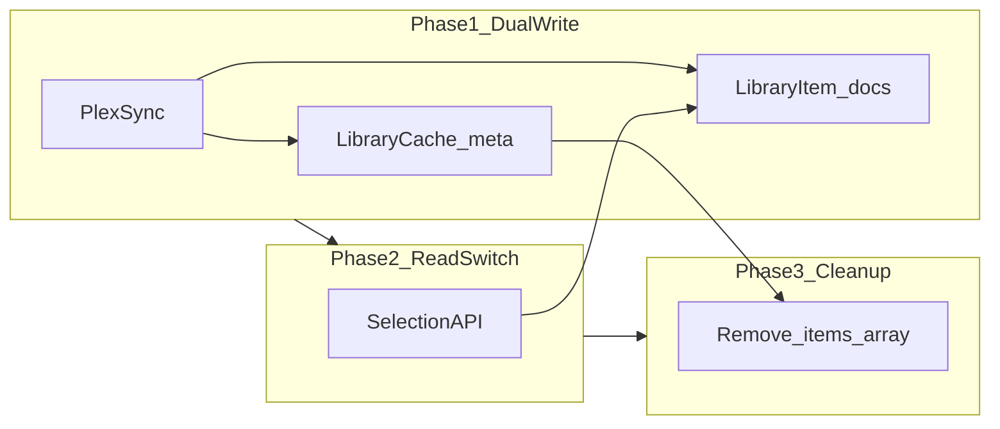

# Feature: Library Item Normalization (Query-Backed Selection)

## Status

`Planned` — implement after [01](./01-correctness-quick-fixes.md), [05](./05-test-coverage-expansion.md), and selection regression tests are green.

## What & Why

`LibraryCache` stores entire Plex libraries as embedded `items[]` arrays in a single MongoDB document. Selection and pool-count routes load all matching caches and flatten arrays in application memory. This pattern risks approaching MongoDB's 16MB document limit for large libraries, increases read latency and memory use, and prevents indexed server-side filtering. Normalizing items into a dedicated collection enables scalable queries and sets up future features (incremental sync, background enrichment).

## User Outcomes

- As a **user** with a large Plex library, I want spins and pool counts to remain fast and accurate.
- As a **operator**, I want sync and enrichment to scale without single-document size failures.

## Non-Goals

- Changing Plex sync frequency UX.
- Real-time sync / webhooks from Plex.
- Elasticsearch or external search engine.
- Per-user library cache in this spec (remains `plexMachineId` scoped unless product changes).

## Implementation Snapshot

### Current

```typescript
// LibraryCache — one doc per library
{
  plexMachineId: string;
  libraryId: string;
  items: ILibraryItem[];  // unbounded array
  lastSyncedAt: Date;
  expiresAt: Date;
}
```

Selection flow:

1. `LibraryCache.find({ plexMachineId, libraryId: { $in } })`
2. `caches.flatMap(c => c.items)`
3. `applyFullFilters(allItems, ...)` in memory

### Target

```typescript
// LibraryCache — metadata only
interface ILibraryCacheMeta {
  plexMachineId: string;
  libraryId: string;
  libraryName: string;
  mediaType: 'movie' | 'show';
  itemCount: number;
  lastSyncedAt: Date;
  expiresAt: Date;
  syncStatus?: 'idle' | 'syncing' | 'error';
  lastSyncError?: string;
}

// LibraryItem — one doc per item
interface ILibraryItemDoc {
  plexMachineId: string;
  libraryId: string;
  plexId: string;
  title: string;
  year?: number;
  thumbPath?: string;
  artPath?: string;
  genres?: string[];
  rating?: number;
  contentRating?: string;
  studio?: string;
  tmdbId?: string;
  overseerrStatus?: 'available' | 'partially_available';
  enrichedAt?: Date;
  overseerrSyncedAt?: Date;
  addedAt?: Date;
  type?: string;
  // ...remaining ILibraryItem fields
}
```

## 1. Data Model Changes

### New collection: `LibraryItem`

**Indexes:**

```typescript
// Unique item identity
{ plexMachineId: 1, libraryId: 1, plexId: 1 }  // unique

// Selection queries
{ plexMachineId: 1, libraryId: 1, mediaType: 1 }
{ plexMachineId: 1, libraryId: 1, year: 1 }
{ plexMachineId: 1, libraryId: 1, rating: 1 }
{ plexMachineId: 1, libraryId: 1, contentRating: 1 }
{ plexMachineId: 1, libraryId: 1, genres: 1 }
{ plexMachineId: 1, libraryId: 1, tmdbId: 1 }
{ plexMachineId: 1, libraryId: 1, overseerrStatus: 1 }
```

Use compound indexes aligned to actual filter query patterns from `src/lib/selection/filters.ts` — profile before over-indexing.

### Modified: `LibraryCache`

- Remove `items` array from schema (after migration).
- Add `itemCount` for quick empty checks.

### Migration (`src/lib/migrate.ts`)

1. For each `LibraryCache` with `items.length > 0`:
   - Bulk upsert into `LibraryItem` keyed by `(plexMachineId, libraryId, plexId)`.
   - Set `itemCount` on metadata doc.
2. Feature flag `LIBRARY_ITEMS_NORMALIZED=true` to read from new collection while dual-writing during rollout.
3. After verification, strip `items` from existing cache documents in a second migration pass.

## 2. API Contract

Public routes unchanged; internal data access changes.

| Route | Internal change |
|-------|-----------------|
| `GET /api/library/[id]/items` | Upsert `LibraryItem` docs; update cache metadata |
| `GET /api/library/genres` | Aggregate distinct `genres` from `LibraryItem` |
| `GET /api/library/years` | `$min`/`$max` on `year` |
| `GET /api/library/filter-options` | Aggregations on `LibraryItem` |
| `POST /api/selection/pool-count` | Query + filter pipeline (see below) |
| `POST /api/selection/random` | Query matching items; random sample |

### Selection query strategy (phase 1)

**Option A — hybrid:** Mongo prefilter on indexed fields (year range, contentRating, overseerrStatus, libraryId), then `applyFullFilters` in memory on reduced set.

**Option B — full pipeline:** Port `applyFullFilters` predicates to `$match` stages where possible.

Start with Option A for lower risk; document Option B as follow-up.

### Random selection

```typescript
// Pseudocode
const candidates = await LibraryItem.find(matchQuery).select(projection).lean();
// if count too large, use $sample aggregation
const selected = candidates[Math.floor(Math.random() * candidates.length)];
```

For very large pools, use `$sample: { size: 1 }` on matched query.

## 3. Frontend Changes

None required if API response shapes unchanged.

**Optional:** Show `itemCount` / sync status from metadata on library selector refresh indicator.

## 4. Acceptance Criteria

### Target

- [ ] Libraries with 5k+ items sync without Mongo document size errors (test with generated fixtures).
- [ ] Pool count and random selection results match pre-migration behavior on shared fixture library (golden tests).
- [ ] `GET /api/library/[id]/items` returns same client-visible fields as before.
- [ ] Migration backfills all existing embedded items to `LibraryItem` collection.
- [ ] Rollback flag can read from embedded `items` if normalization disabled (during dual-write phase only).
- [ ] Genre/year/filter-options endpoints read from `LibraryItem` aggregations.

## 5. Edge Cases

- Partial migration failure → retry idempotent upserts; do not delete embedded items until verified.
- Item removed from Plex → sync deletes stale `LibraryItem` docs not in latest Plex fetch.
- Concurrent syncs for same library → use `syncStatus` lock or findOneAndUpdate guard.
- Collection filter still requires Plex API → unchanged; apply after Mongo prefilter.
- `unwatchedOnly` → join against `WatchedItem` plexIds (may remain in-memory Set for user scope).

## 6. Dependency Map

**Modify:**

- `src/lib/models/LibraryCache.ts`
- `src/lib/migrate.ts`
- `src/app/api/library/[id]/items/route.ts`
- `src/app/api/library/genres/route.ts`
- `src/app/api/library/years/route.ts`
- `src/app/api/library/filter-options/route.ts`
- `src/app/api/selection/random/route.ts`
- `src/app/api/selection/pool-count/route.ts`
- `src/lib/selection/filters.ts` (optional query builders)

**Create:**

- `src/lib/models/LibraryItem.ts`
- `src/lib/library/item-repository.ts` (query/sync abstraction)
- `tests/api/library-normalization-parity.test.ts`
- `tests/fixtures/large-library.json`

**Depends on:**

- [01-correctness-quick-fixes](./01-correctness-quick-fixes.md)
- [05-test-coverage-expansion](./05-test-coverage-expansion.md)
- [beta/02-library-data-foundation.md](../beta/02-library-data-foundation.md)
- [beta/03-selection-filters-command-center.md](../beta/03-selection-filters-command-center.md)

**Blocked by:**

- Golden parity test suite for selection/filter outputs

## 7. Rollout / Migration Plan

1. **Phase 0:** Add golden tests capturing pool-count/random outputs for fixture library (current schema).
2. **Phase 1:** Create `LibraryItem` model; dual-write on sync (embedded + normalized).
3. **Phase 2:** Switch read path behind env flag; verify parity in staging.
4. **Phase 3:** Migrate metadata-only `LibraryCache`; remove embedded arrays.
5. **Phase 4:** Add aggregations for genre/year/filter-options.
6. **Phase 5:** Optimize with `$sample` and expanded `$match` (Option B).



## 8. Verification

**Automated:**

- `npm run test -- tests/api/library-normalization-parity`
- `npm run test -- tests/api/selection`
- Load test script (optional): sync 5k item fixture under 30s

**Manual:**

- Production-like library refresh; compare pool counts before/after flag flip.

## 9. Task Handoff

- **Backlog ID:** `DECIDARR-REMED-07`
- **First safe task:** Golden parity tests on current schema
- **Review boundary:** Dual-write only in first PR; no read switch
- **Evidence:** Parity test pass; migration logs with item counts

## Agent Activation

- **Lead agent:** Senior Developer + software-architect for schema review
- **Pair agent:** database-optimizer for index plan
- **Activation mode:** gated — parity tests required before read switch
- **Do not activate:** UI redesign agents; keep API shapes stable
